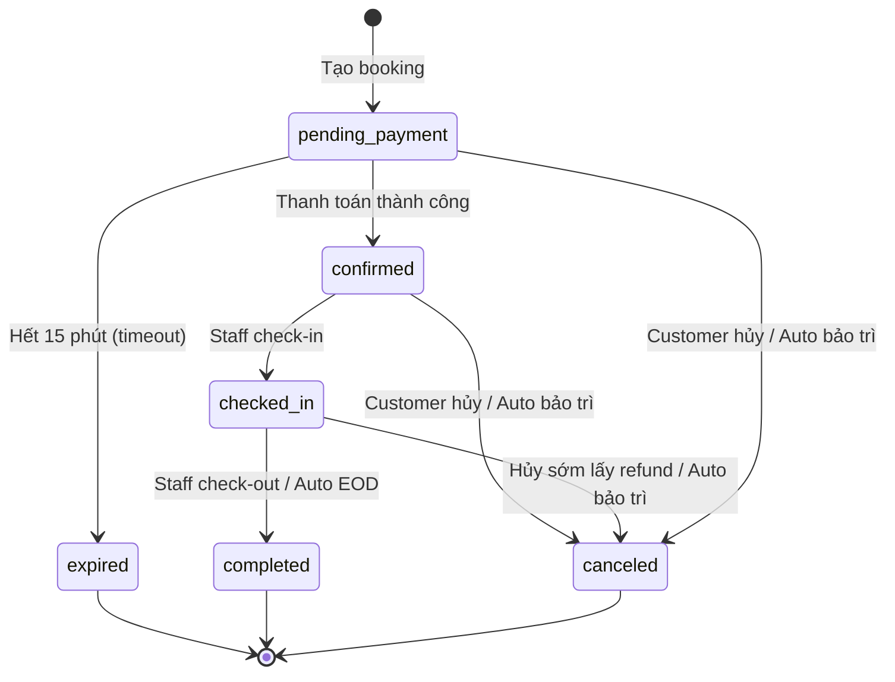

# Use Case Specifications — Booking Engine

> **Module**: Booking Engine (Sprint 3)
> **Tham chiếu**: [SYSTEM_SPEC.md §3.3](file:///d:/DA/docs/SYSTEM_SPEC.md), [DEVELOPMENT_PLAN.md Sprint 3](file:///d:/DA/docs/DEVELOPMENT_PLAN.md)
> **Ngày**: 2026-06-30

---

## UC-BOOK-01: Tạo Đặt Chỗ Ngắn Hạn (Giờ/Ngày)

### Tổng quan
| Thuộc tính | Giá trị |
|-----------|--------|
| **Actor chính** | Customer |
| **Actor phụ** | Staff (tạo thay mặt tại quầy) |
| **Trigger** | Customer chọn workspace + thời gian trên giao diện đặt chỗ |
| **Precondition** | Customer đã đăng nhập, workspace tồn tại và status = `active` |
| **Postcondition** | Booking record được tạo (status = `pending_payment`), Payment record được tạo |

### Luồng Chính (Main Flow) — Customer đặt qua Web

```
1. Customer mở trang đặt chỗ
2. Customer chọn chi nhánh (branch)
3. Hệ thống hiển thị danh sách tầng (floors) và sơ đồ SVG
4. Customer chọn tầng → hệ thống render SVG floorplan
5. Customer chọn workspace trên SVG (hoặc từ list)
6. Customer chọn thời gian:
   - Ngày bắt đầu + giờ bắt đầu
   - Đơn vị thời gian: hour hoặc day
   - Số đơn vị: unit_count (ví dụ: 2 giờ, 3 ngày)
   → Hệ thống tự tính end_at = start_at + (unit × unit_count)
7. Hệ thống kiểm tra:
   a. Workspace không có booking overlap (status ∈ {pending_payment, confirmed, checked_in})
   b. Workspace không có maintenance overlap (status ∈ {scheduled, active})
   c. Thời gian start_at ≥ now() (không đặt quá khứ)
8. Hệ thống tính giá:
   a. Tìm price_policy: ưu tiên branch-specific → fallback global
   b. subtotal_amount = price × unit_count
   c. discount_amount = 0 (MVP không có discount logic)
   d. addon_amount = 0 (chưa thêm dịch vụ)
   e. total_amount = subtotal - discount + addon
9. Hệ thống tạo:
   - Booking (status = pending_payment, source = web)
   - booking_code = auto-generate (unique, 8-10 ký tự)
   - is_contract = false (vì unit = hour/day)
   - payment_deadline_at = now() + 15 phút
10. Customer được chuyển sang luồng thanh toán (UC-PAY-01)
```

### Luồng Thay Thế — Staff tạo tại quầy (source = counter)

```
1-6. Như Main Flow, nhưng Staff thao tác trên giao diện Staff
7-8. Như Main Flow
9. Hệ thống tạo:
   - Booking (status = pending_payment, source = counter)
   - payment_deadline_at = NULL (thanh toán tiền mặt không timeout)
10. Staff chuyển sang luồng thanh toán tiền mặt (UC-PAY-02)
```

### Luồng Ngoại Lệ (Exception Flows)

| # | Điều kiện | Xử lý |
|---|----------|-------|
| E1 | Workspace bị overlap (đã có booking khác) | Trả lỗi `WORKSPACE_NOT_AVAILABLE`, hiển thị khung giờ đã bận |
| E2 | Workspace đang bảo trì | Trả lỗi `WORKSPACE_UNDER_MAINTENANCE`, hiển thị thời gian bảo trì |
| E3 | Không tìm thấy price_policy | Trả lỗi `PRICE_NOT_CONFIGURED`, thông báo admin cấu hình giá |
| E4 | start_at < now() | Trả lỗi `INVALID_TIME_RANGE`, không cho đặt quá khứ |
| E5 | Workspace status ≠ active | Trả lỗi `WORKSPACE_INACTIVE` |
| E6 | Chống Spam (Rate Limit) | App Layer BẮT BUỘC dùng `pg_advisory_xact_lock` trên user_id trước khi đếm. Nếu có ≥ 3 booking ở trạng thái `pending_payment`, trả lỗi `RATE_LIMIT_EXCEEDED`. |

### Quy Tắc Nghiệp Vụ

| # | Rule | Chi tiết |
|---|------|---------|
| R1 | Overlap check | `SELECT FOR UPDATE` trên bảng bookings, filter workspace_id + time range + active statuses |
| R2 | Maintenance check | Query `workspace_maintenance` cùng workspace_id + time range, status ∈ {scheduled, active} |
| R3 | Pricing lookup | `WHERE workspace_type_id = :type AND duration_unit = :unit AND is_active = true ORDER BY branch_id DESC NULLS LAST LIMIT 1` |
| R4 | booking_code format | `BK-{YYYYMMDD}-{random 5 chars}` (ví dụ: BK-20260630-A3K9X) |
| R5 | is_contract | `false` khi unit ∈ {hour, day} |
| R6 | branch_id consistency | `booking.branch_id = workspace → floor → branch.id` (auto-set, không cho customer nhập) |

---

## UC-BOOK-02: Tạo Hợp Đồng Thuê Dài Hạn (Tuần/Tháng)

### Tổng quan
| Thuộc tính | Giá trị |
|-----------|--------|
| **Actor chính** | Customer |
| **Actor phụ** | Staff, Branch Admin |
| **Trigger** | Customer chọn workspace + đơn vị tuần/tháng |
| **Precondition** | Như UC-BOOK-01 |
| **Postcondition** | Booking record được tạo với `is_contract = true` |

### Khác biệt so với UC-BOOK-01

| Yếu tố | Đặt chỗ (UC-BOOK-01) | Hợp đồng thuê (UC-BOOK-02) |
|---------|----------------------|---------------------------|
| `duration_unit` | hour, day | week, month |
| `is_contract` | false | true (auto-set) |
| `unit_count` | 1-24 giờ, 1-30 ngày | 1-52 tuần, 1-12 tháng |
| Giao diện | Tab "Đặt chỗ" | Tab "Thuê dài hạn" |
| Cancellation | Policy chung | Có thể áp policy riêng cho contract |
| Price | Giá/giờ hoặc giá/ngày | Giá/tuần hoặc giá/tháng |

### Luồng Chính

Giống UC-BOOK-01, ngoại trừ:
- Bước 6: `duration_unit` = week hoặc month
- Bước 9: `is_contract = true` (tự động set bởi hệ thống)
- `end_at` = start_at + (unit_count × 7 ngày) hoặc + (unit_count tháng)

### Quy Tắc Bổ Sung

| # | Rule | Chi tiết |
|---|------|---------|
| R7 | Auto is_contract | Khi `duration_unit` ∈ {week, month} → `is_contract = true` |
| R8 | Giới hạn duration | week: max 52 tuần. month: max 12 tháng (MVP) |

---

## UC-BOOK-03: Xem Lịch Sử Đặt Chỗ

### Tổng quan
| Thuộc tính | Giá trị |
|-----------|--------|
| **Actor chính** | Customer, Branch Admin, System Admin |
| **Trigger** | Actor truy cập trang lịch sử |
| **Precondition** | Đã đăng nhập |

### Phân quyền xem

| Role | Phạm vi dữ liệu | Bộ lọc |
|------|-----------------|--------|
| Customer | Chỉ bookings của mình | status, is_contract, thời gian |
| Staff | Bookings tại chi nhánh mình | status, is_contract, workspace, thời gian |
| Branch Admin | Tất cả bookings tại chi nhánh | + customer, workspace_type |
| System Admin | Tất cả bookings toàn hệ thống | + branch, tất cả filter trên |

### Thông tin hiển thị

```json
{
  "booking_code": "BK-20260630-A3K9X",
  "workspace": { "name": "Desk A-01", "type": "desk", "floor": "Tầng 1" },
  "branch": { "name": "CoSpace Quận 1" },
  "time": { "start_at": "...", "end_at": "...", "unit": "hour", "count": 2 },
  "is_contract": false,
  "status": "confirmed",
  "total_amount": 100000,
  "payment_status": "paid",
  "created_at": "..."
}
```

### Pagination & Sorting
- Default: `ORDER BY created_at DESC`
- Pagination: `?page=1&size=20`
- Filter: `?status=confirmed&is_contract=false&from=2026-06-01&to=2026-06-30`

---

## UC-BOOK-04: Thêm Dịch Vụ Bổ Sung Vào Booking

### Tổng quan
| Thuộc tính | Giá trị |
|-----------|--------|
| **Actor chính** | Customer |
| **Trigger** | Customer chọn add-on services khi tạo booking hoặc sau khi booking đã confirmed |
| **Precondition** | Booking tồn tại, status ∈ {pending_payment, confirmed} |
| **Postcondition** | booking_services records được tạo, booking.addon_amount & total_amount cập nhật |

### Luồng Chính

```
1. Customer xem danh sách dịch vụ bổ sung khả dụng:
   - Ưu tiên: services branch-specific → fallback global
   - Chỉ hiển thị is_active = true
2. Customer chọn dịch vụ + nhập số lượng
   - Ví dụ: Cà phê × 2, In ấn × 10 trang
3. Hệ thống tính:
   - unit_price = snapshot từ extra_services.price tại thời điểm thêm
   - line_total = unit_price × quantity
4. Hệ thống tạo booking_services record(s)
5. Hệ thống cập nhật booking:
   - addon_amount = SUM(line_total) từ tất cả booking_services
   - total_amount = subtotal_amount - discount_amount + addon_amount
6. Xử lý thanh toán:
   - Nếu booking đang `pending_payment`: Giá trên trang thanh toán tự động cập nhật.
   - Nếu booking đã `checked_in` (Cyber-cafe model): Tạo một bản ghi `payments` MỚI (amount = tiền dịch vụ phát sinh, method = cash/momo). Staff thu tiền và update payment này thành `paid`. Không thay đổi trạng thái booking.
```

### Luồng Ngoại Lệ

| # | Điều kiện | Xử lý |
|---|----------|-------|
| E1 | Dịch vụ đã tồn tại trong booking | Cập nhật quantity (UPSERT), tính lại line_total. |
| E2 | Booking đã completed/canceled/expired | Trả lỗi `BOOKING_NOT_MODIFIABLE`. (Chỉ cho phép thêm khi `pending_payment`, `confirmed` hoặc `checked_in`). |
| E3 | quantity ≤ 0 | Trả lỗi `INVALID_QUANTITY` |

### Quy Tắc Nghiệp Vụ

| # | Rule | Chi tiết |
|---|------|---------|
| R9 | Price snapshot | `unit_price` snapshot tại thời điểm thêm, không bị ảnh hưởng khi admin đổi giá sau |
| R10 | Unique constraint | `(booking_id, extra_service_id)` UNIQUE — mỗi dịch vụ 1 dòng per booking |
| R11 | Service scope | Lấy services: `WHERE (branch_id = :bookingBranchId OR branch_id IS NULL) AND is_active = true` |

---

## UC-BOOK-05: Gia Hạn Thời Gian Đặt Chỗ (Extending Duration)

### Tổng quan
| Thuộc tính | Giá trị |
|-----------|--------|
| **Actor chính** | Customer, Staff |
| **Trigger** | Khách muốn ngồi thêm giờ và yêu cầu gia hạn |
| **Precondition** | Booking đang ở trạng thái `checked_in` |
| **Postcondition** | `end_at` được cập nhật, sinh ra bản ghi `payments` mới |

### Luồng Chính
```
1. Customer/Staff chọn chức năng "Gia hạn" trên booking hiện tại.
2. Nhập số lượng thời gian muốn thêm (VD: thêm 1 giờ).
3. Hệ thống tính toán thời gian `end_at` mới.
4. Hệ thống kiểm tra Overlap:
   - Đảm bảo khoảng thời gian mới thêm không bị trùng với booking của người khác.
5. Hệ thống tính toán số tiền chênh lệch (dựa vào price_policy hiện hành).
6. Hệ thống cập nhật booking:
   - end_at = end_at_new
   - unit_count = unit_count_new
   - subtotal_amount và total_amount tăng lên.
7. Hệ thống tạo một bản ghi `payments` MỚI cho phần tiền chênh lệch.
8. Staff thu tiền mặt (hoặc khách thanh toán MoMo) cho bản ghi payment mới này.
```

### Luồng Ngoại Lệ
| # | Điều kiện | Xử lý |
|---|----------|-------|
| E1 | Overlap với booking khác | Báo lỗi `WORKSPACE_NOT_AVAILABLE`, gợi ý khách tạo booking mới ở phòng khác. |
| E2 | Booking không hợp lệ | Chỉ cho phép gia hạn khi đang `checked_in`. Nếu trạng thái khác, báo lỗi `BOOKING_NOT_MODIFIABLE`. |

---

## Bảng Tổng Hợp Status Transition



### Ma Trận Chuyển Trạng Thái

| Từ \ Sang | pending_payment | confirmed | checked_in | completed | canceled | expired |
|-----------|:-:|:-:|:-:|:-:|:-:|:-:|
| pending_payment | - | ✅ (payment success) | ❌ | ❌ | ✅ (khách hủy/bảo trì) | ✅ (timeout) |
| confirmed | ❌ | - | ✅ (check-in) | ❌ | ✅ (khách hủy/bảo trì) | ❌ |
| checked_in | ❌ | ❌ | - | ✅ (check-out/Auto EOD) | ✅ (abort sớm/bảo trì) | ❌ |
| completed | ❌ | ❌ | ❌ | - | ❌ | ❌ |
| canceled | ❌ | ✅ (Late webhook tạo refund) | ❌ | ❌ | - | ❌ |
| expired | ❌ | ✅ (Late webhook tạo refund) | ❌ | ❌ | ❌ | - |

> **Note**: Ở luồng Late Webhook (`canceled` hoặc `expired` chuyển sang `confirmed`), việc chuyển đổi này chỉ mang ý nghĩa mặt Logic Payment (để thanh toán chuyển sang `paid` và trigger sinh Refund), còn bản thân giá trị `bookings.status` ở Database vẫn GIỮ NGUYÊN là `canceled` hoặc `expired`.

---

## Danh Sách Error Codes (Booking Module)

| Code | HTTP Status | Mô tả |
|------|------------|--------|
| `WORKSPACE_NOT_FOUND` | 404 | Workspace không tồn tại |
| `WORKSPACE_NOT_AVAILABLE` | 409 | Workspace đã có booking overlap |
| `WORKSPACE_UNDER_MAINTENANCE` | 409 | Workspace đang bảo trì |
| `WORKSPACE_INACTIVE` | 400 | Workspace không active |
| `PRICE_NOT_CONFIGURED` | 500 | Chưa cấu hình giá cho loại workspace + duration |
| `INVALID_TIME_RANGE` | 400 | start_at ≥ end_at hoặc start_at < now() |
| `INVALID_DURATION_UNIT` | 400 | duration_unit không hợp lệ |
| `INVALID_QUANTITY` | 400 | unit_count hoặc service quantity ≤ 0 |
| `BOOKING_NOT_FOUND` | 404 | Booking không tồn tại |
| `BOOKING_NOT_MODIFIABLE` | 400 | Booking đã completed/canceled/expired |
| `UNAUTHORIZED_BRANCH` | 403 | Staff/Admin thao tác ngoài chi nhánh |

---
